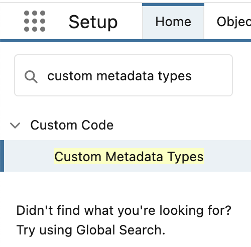
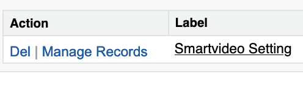
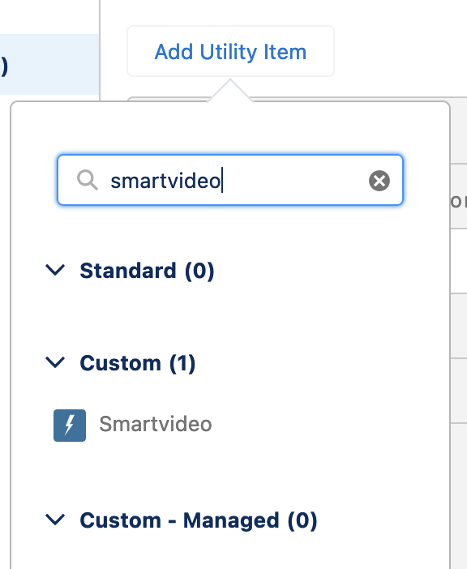
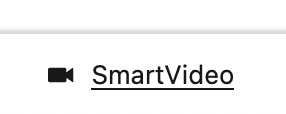

# Videoengager's SmartVideo package for Salesforce

VideoEngage Salesforce companion component used to enhance CTI with video calling capabilites

# Installation

## One click
Andrew Fawcett's solution for one click install

<a href="https://githubsfdeploy.herokuapp.com">
  
</a>

## Manual via CLI

### In Dev/Sandbox org

1. Authorize your dev/sandbox org with and set it an alias (**mydevorg**) if it is not:
    ```
    sf org login web -d -a mydevorg
    ```

1. Clone the repository:

    ```
    git clone https://github.com/VideoEngager/LightningVeComponent.git
    cd LightningVeComponent
    ```
1. Push the code to your org (**mydevorg**):

    ```
    sf project deploy start -o mydevorg
    ```

1. Open the org from CLI (**mydevorg**):

    ```
    sf org open -o mydevorg
    ```

### In a Scratch Org

1. Authorize your devhub org with and set it an alias (**mydevhub**):

    ```
    sf org login web -d -a mydevhub
    ```

1. Clone the repository:

    ```
    git clone https://github.com/VideoEngager/LightningVeComponent.git
    cd LightningVeComponent
    ```

1. Create scratch org and set an alias (**LightningVeComponent**):

    ```
    sf org create scratch -d -f config/project-scratch-def.json -a LightningVeComponent
    ```

1. Push the code to your scratch org:

    ```
    sf project deploy start
    ```

1. Open the scratch org from CLI:

    ```
    sf org open
    ```

## Configuration

### 1. SmartVideo settings (optional)

This setting is optional and may only need to be changed if you have been instructed to do so. This operation requires Salesforce Administrator.

1. Login into your org
1. Open Setup and search for `custom metadata types`

   
1. Locate `Smartvideo Setting` custom metadata type and click `Manage Records`

   
1. Locate record `Environment` and click `Edit`
1. In the `Value` field you need to put the value you asked to change.

### 2. Adding SmartVideo to Salesforce Utility Bar (mandatory)

This operation requires Salesforce Administrator.

1. Login into your org
1. Open Setup and search for `App manager` and click on result link.
1. In `Lightning Experience App Manager` you should locate your target Application where you want to install this component. `App type` should be `Lightning`. Click `Edit` from action button on your App (For example `Sales`).
1. In `Lightning App Builder` locate `App Settings` and choose `Utility Items (Desktop Only)`
1. Click on `Add Utility Item` button and search for `smartvideo`.
  
    

1. In the properties of the component mark `Start automatically` checkbox.
1. Additionally, you can choose another label and other icon
1. Once you are finished with setting you should click `Save` button.
1. On your home page, make sure you're in the same App you changed to add the Smartvideo component (like `Sales`).
1. If successful, you will see our component in the utility bar below and you can start making video calls.
  
    

1. And if you click on that button it will open the component
    
    

